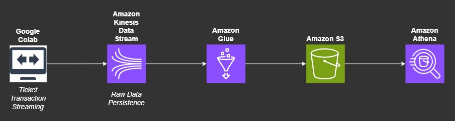

# AWS-TicketTransactionStreamingData
## Steps
- [Introduction](##Introduction)
- [Setup](##Setup)
- [Architecture-Diagram](##Architecture-Diagram)

## Introduction
This guide will assist in configuring the laboratory environment for real-time Ticket Transaction Streaming Data, emphasizing its practical application.

- Google Colab: Who generate real time data for Ticket Transaccion (TicketTransactionStreamingData.py).
- One Amazon Simple Storage Service (Amazon S3) buckets: You will use these buckets to .
- ???????.
- ???????.

## Setup
###  AWS KINESIS DATA STREAM:

#### Data stream configuration
    - Data stream name -> TicketTransactionStreamingDataKinesis
    - All default configuration

#### Data stream capacity
    - Provisioned shard -> 2
    - All default configuration

### AWS GLUE

#### Visual ETL
    - Data source -> Amazon Kinesis
    - Data Catalog table -> tickettransactiondatabase
    - Table ->  tickettransactiondatatable
    - Detect schema -> yes

    - Data target -> Amazon s3
    - Node Parents -> Amazon Kinesis
    - Format -> Parquet
    - Compression Type -> Uncompressed
    - S3 Target Location -> YOUR S3 LOCATION TARGET
    - Do not update the Data Catalog

#### Table details
    - Name -> tickettransactionstreamdatatable
    - Location -> TicketTransactionStreamingDataKinesis
    - Database -> tickettransactiondatabase
    - Clasification -> JSON

#### Job details
    - Name -> TicketTransactionStreamingJob
    - IAM Role -> YOUR IAM ROLE
    - Type -> Spark Streaming
    - Glue version -> Glue 4.0 Support spark 3.3, Scala2, Python 3
    - Language -> 3
    - Worker type -> G 1x
    - Requested number of workers -> 2

#### Crawler Properties
    - Name -> TicketTransactionParquetDataCrawler
    - Database -> tickettransactiondatabase
    - Table prefix -> parquet_
    - Time -> Every hour
    - Data sources -> YOUR_S3
    - Parameters -> Recrawl all

### AWS ATHENA

#### Query editor
    - Data source -> AwsDataCatalog
    - Database -> tickettransactiondatabase
    - Tables and views -> parquet_tickettransactionstreamingdata

#### Query Example

    SELECT count(*) as numberOfTransactions, sourceip
    FROM "tickettransactiondatabase"."parquet_tickettransactionstreamingdata" 
    WHERE ingest_year='2023'
    AND cast(ingest_year as bigint)=year(now())
    AND cast(ingest_month as bigint)=month(now())
    AND cast(ingest_day as bigint)=day_of_month(now())
    AND cast(ingest_hour as bigint)=hour(now())
    GROUP BY sourceip
    Order by numberOfTransactions DESC;

    SELECT count(*) as numberOfTransactions, sourceip
    FROM "tickettransactiondatabase"."parquet_tickettransactionstreamingdata" 
    WHERE ingest_year='2023'
    GROUP BY sourceip
    Order by numberOfTransactions DESC;

## Architecture-Diagram

